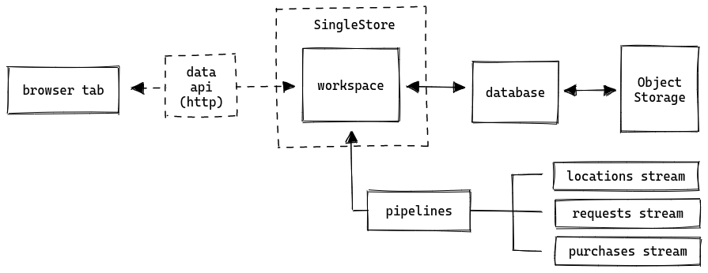

# SingleStore demo: Realtime Digital Marketing <!-- omit in toc -->

**Attention**: The code in this repository is intended for experimental use only and is not fully tested, documented, or supported by SingleStore. Visit the [SingleStore Forums](https://www.singlestore.com/forum/) to ask questions about this repository.


- [Code tour](#code-tour)
- [Data simulator](#data-simulator)
  - [`./gen`](#gen)
  - [`./output`](#output)
- [Stored Procedures](#stored-procedures)
- [Web application](#web-application)
  - [Quickstart: Docker Image](#quickstart-docker-image)
  - [Quickstart: SingleStore Managed Service](#quickstart-singlestore-managed-service)
- [Running the web interface locally](#running-the-web-interface-locally)
- [Manually running the demo in pure SQL](#manually-running-the-demo-in-pure-sql)

This application is a demo of how to use [SingleStore][singlestore] to serve ads to users based on their behavior and realtime location. The demo is based on location, purchase, and request history from millions of simulated subscribers for a hypothetical service company.

This application runs entirely within the web-browser and can be accessed publicly at https://digital-marketing.labs.singlestore.com



If you have any questions or issues, please file an issue on the [GitHub repo][gh-issues] or our [forums][forums].

[singlestore]: https://www.singlestore.com
[gh-issues]: https://github.com/singlestore-labs/demo-realtime-digital-marketing/issues
[forums]: https://www.singlestore.com/forum/

# Code tour

This repository contains a data simulation tool written in go as well as a web application written in typescript. Refer to the following file tree for an overview of the code.

```
.
├── cmd
│   └── simulator (data simulation tool entrypoint)
├── data
│   ├── cities.ndjson (coordinates of many cities worldwide)
│   └── vendors.json (randomly generated vendors)
├── gen (go package for data generation)
├── output (go package for writing Parquet and JSON files out to the cloud)
├── README.md (this file!)
├── sql (all of the SQL data definition language (DDL) used in the demo)
├── util (go utility package)
└── web (the web application)
    └── src
        ├── components (React components)
        ├── data (React hooks and all networking code)
        │   ├── client.ts (HTTP client for querying SingleStore)
        │   ├── queries.ts (SQL queries)
        │   ├── recoil.ts (Recoil atoms and selectors)
        └── main.tsx (web application entrypoint)
```

# Data simulator

The simulator is written in Golang. Internally it is modular, allowing it to output data in multiple formats to different storage providers. The recommended production outputter is S3/Parquet.

The simulator can be configured using command line flags. By default it will write to `/tmp/subscriber-sim` (will error if this directory is missing). You can run it using default settings like so:

```bash
mkdir -p /tmp/subscriber-sim
go run cmd/simulator/main.go
```

After running this command using default settings a bunch of JSON files will be written to `/tmp/subscriber-sim`. Inspect some of those files to get an idea of what the generated data looks like.

## `./gen`

The `gen` package is responsible for generating the data. It has a driver which leverages many concurrent goroutines to iterate through all of the subscribers as fast as possible.

Data generated by the simulator is designed to be loaded repeatedly to simulate device streams coming from many different locations over time. To help achieve this, timestamps are not included in the generated data and location is output as coordinates on the unit circle (centered at `[0,0]`)

## `./output`

The `output` package is responsible for encoding and uploading the data to a target. The primary interface it exposes is `output.Writer`. The output package supports the following encodings/output targets:

- Encodings
  - Parquet
  - JSON
- Targets
  - Local filesystem
  - Anything supported by https://gocloud.dev/blob (e.g. S3)

# Stored Procedures

This demo makes extensive use of stored procedures which contain all of the logic required to load the data, segment users, and match subscribers to offers. You can find all of procedure code in [./sql/procedures.sql](sql/procedures.sql). Many procedures also depend on views which are all defined in [./sql/schema.sql](./sql/schema.sql).

# Web application

The [user interface][demo] is implemented as a single-page web application which runs entirely in the browser. The interface connects to any SingleStore cluster which has the [Data API][data-api] enabled. To get started quickly, we recommend either using our [Docker image][ciab] or the [SingleStore Managed Service][portal].

## Quickstart: Docker Image

**This will not work on a Mac M1 or ARM hardware**

1. [Sign up][try-free] for a free SingleStore license. This allows you to run up to 4 nodes up to 32 gigs each for free. Grab your license key from [SingleStore portal][portal] and set it as an environment variable.

   ```bash
   export SINGLESTORE_LICENSE="singlestore license"
   ```

2. Start a SingleStore [cluster-in-a-box][ciab] using Docker:

   ```bash
   docker run -it \
       --name ciab \
       -e LICENSE_KEY=${SINGLESTORE_LICENSE} \
       -e ROOT_PASSWORD=test \
       -e HTTP_API=on \
       -p 3306:3306 -p 9000:9000 -p 8080:8080 \
       singlestore/cluster-in-a-box
   docker start ciab
   ```

3. Open the [Digital Marketing demo][demo] in Chrome or Firefox
4. Plug in the connection details:
   
| Key         | Value                 |
| ----------- | --------------------- |
| Host & Port | http://localhost:9000 |
| Username    | root                  |
| Password    | test                  |
   
## Quickstart: SingleStore Managed Service

1. [Sign up][try-free] for $500 in free managed service credits.
2. Create a S-00 sized cluster in [the portal][portal]
3. Open the [Digital Marketing demo][demo] in Chrome or Firefox
4. Plug in the connection details (replacing placeholders as needed):
   
| Key         | Value                          |
| ----------- | ------------------------------ |
| Host & Port | https://CLUSTER_CONNECTION_URL |
| Username    | admin                          |
| Password    | CLUSTER_ADMIN_PASSWORD         |

[try-free]: https://www.singlestore.com/try-free/
[demo]: https://digital-marketing.labs.singlestore.com
[data-api]: https://docs.singlestore.com/managed-service/en/reference/data-api.html
[ciab]: https://github.com/memsql/deployment-docker
[portal]: https://portal.singlestore.com/

# Running the web interface locally

Rather than using https://digital-marketing.labs.singlestore.com it's possible to run the web interface locally via Docker. You can do this like so:

```bash
docker run -d --name demo -p 3000:3000 ghcr.io/singlestore-labs/demo-realtime-digital-marketing
```

After running the above command the web interface will be running at http://localhost:3000.

# Manually running the demo in pure SQL

This entire demo can be run standalone on any SingleStore cluster without needing the Web UI. To do this, run all of the SQL scripts in the [./sql](./sql) folder in the following order:

* functions.sql
* schema.sql
* procedures.sql
* seed.sql
* pipelines.sql (requires variable replacement, see below)

We can do this on the command line like so:

```bash
mysql -u root -h 172.17.0.3 -ptest -e "create database martech"
mysql -u root -h 172.17.0.3 -ptest martech < sql/functions.sql
mysql -u root -h 172.17.0.3 -ptest martech < sql/schema.sql
mysql -u root -h 172.17.0.3 -ptest martech < sql/procedures.sql
mysql -u root -h 172.17.0.3 -ptest martech < sql/seed.sql
sed 's/${PARTITIONS}/2/;s/${SCALE_FACTOR}/v2\/100k-2p/' pipelines.sql | mysql -u root -h 172.17.0.3 -ptest martech
```

Note that we are replacing the PARTITIONS and SCALE_FACTOR variables in pipelines.sql with acceptable values. See [scalefactors.ts](./web/src/scalefactors.ts) for additional options.
